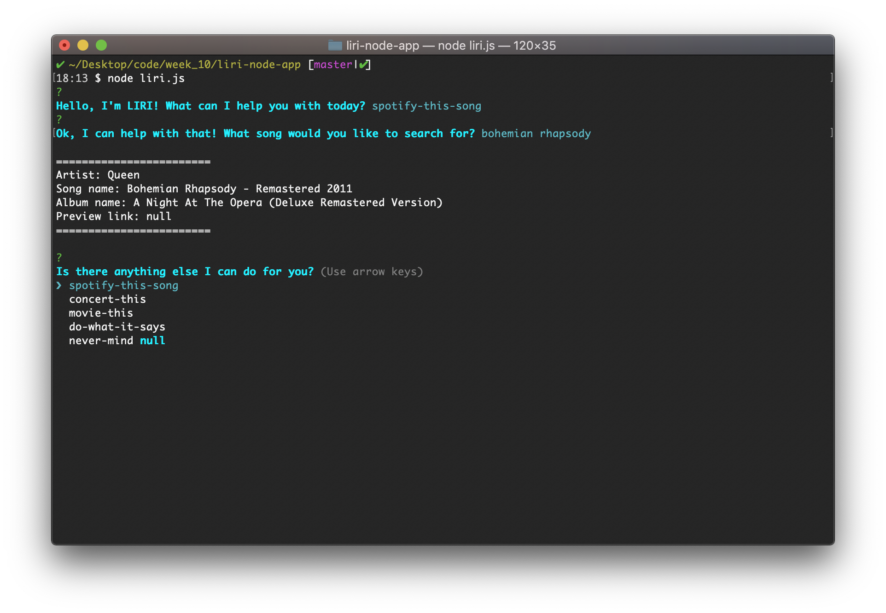
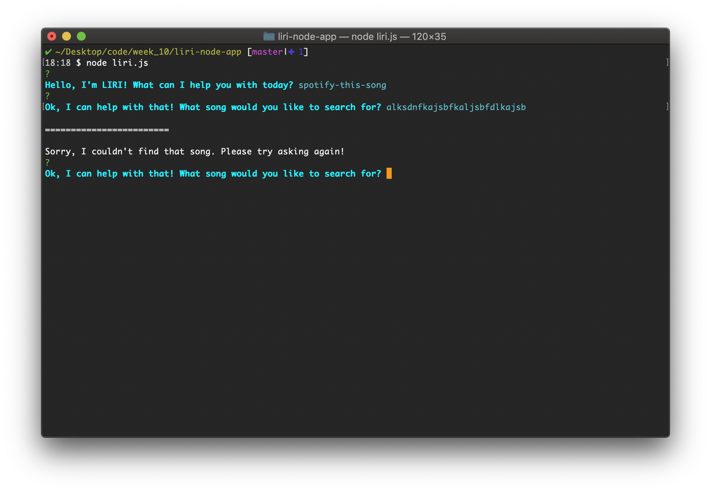
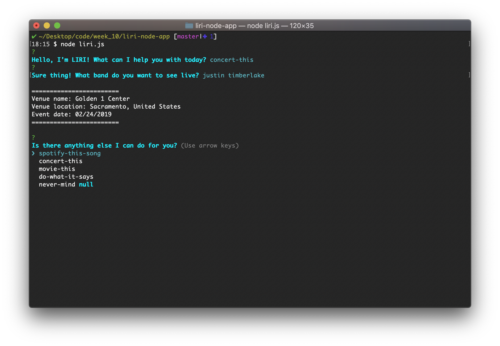
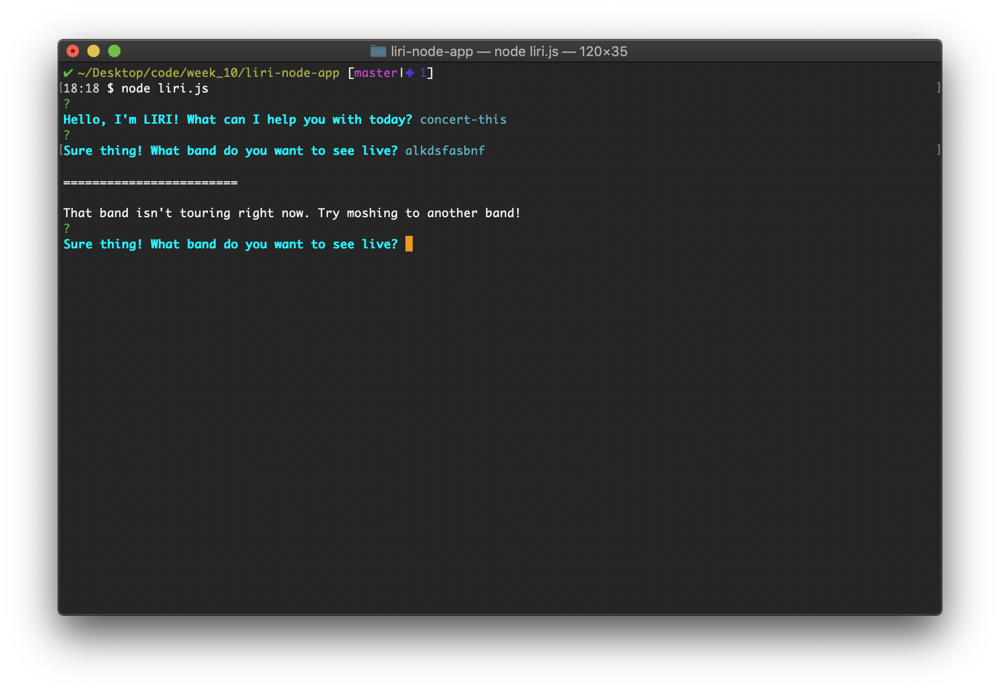
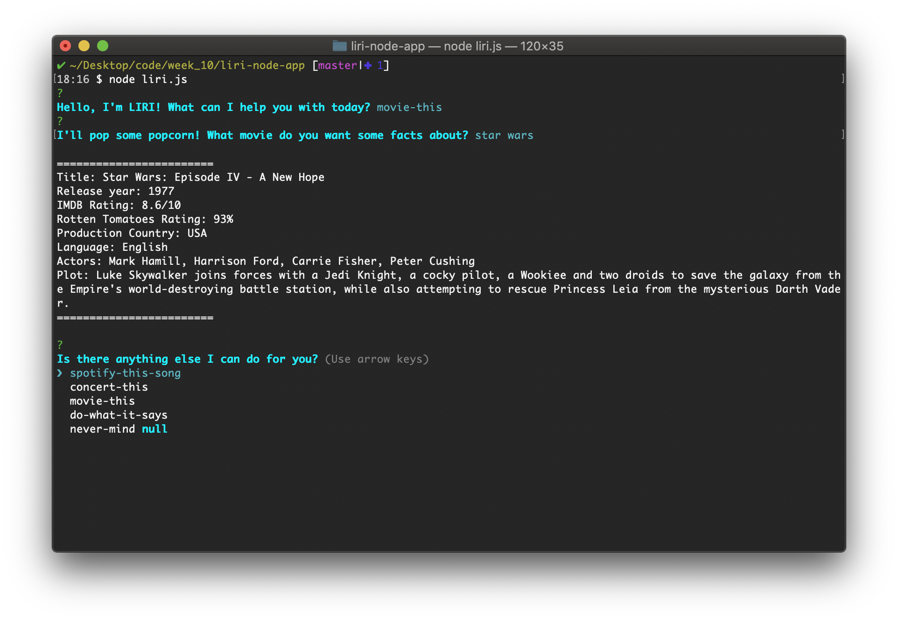
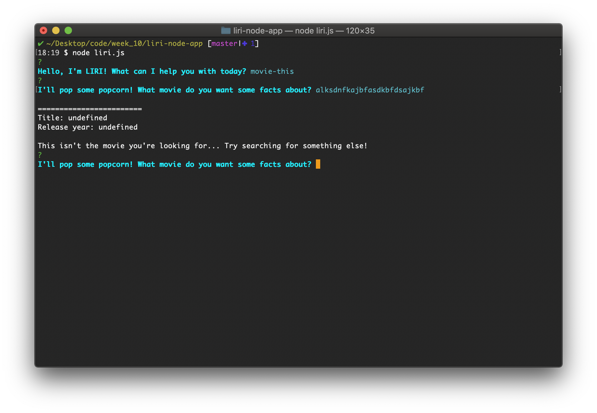
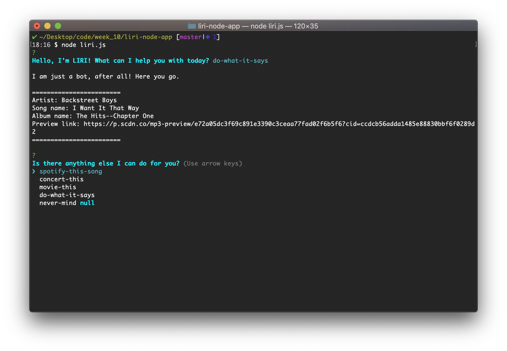
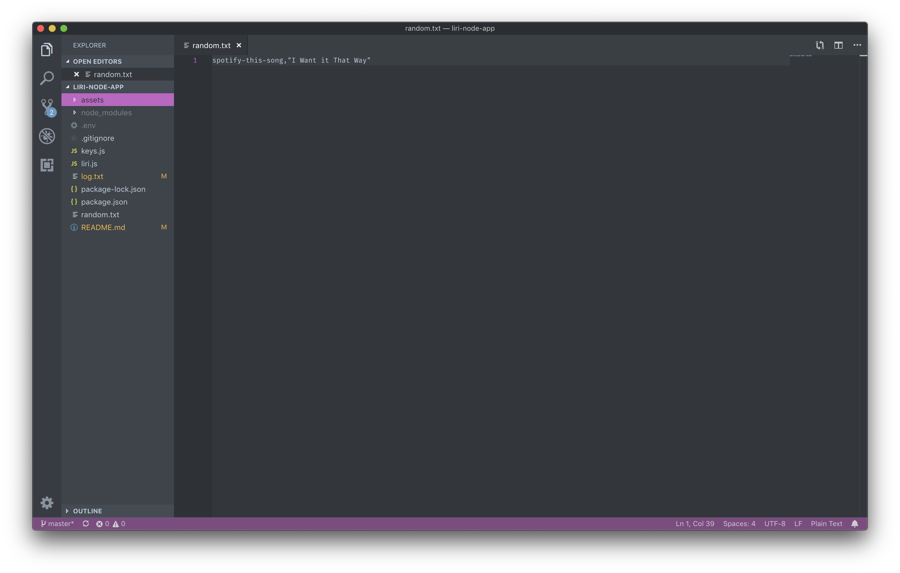
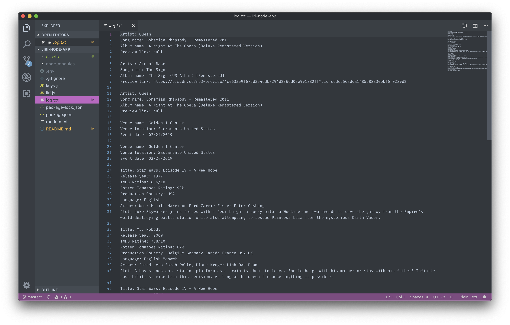

# LIRI Node.js CLI App
A Node.js CLI app that utilizes APIs to take user input and search for real-time information on songs, concerts, and movies.

**Features include:**
* Takes user input and outputs real-time data using APIs:
    * [Spotify API](https://developer.spotify.com/dashboard/)
    * [Bands in Town API](http://www.artists.bandsintown.com/bandsintown-api)
    * [OMDB API](https://www.omdbapi.com/)
* Utilizes Inquirer (NPM Package) prompts to control user input and prevent errors
* App flow allows user to continue asking questions until they are ready to exit the app
* Keeps log of all output

## Workflow

### Video Demo
[LIRI Demo](https://youtu.be/Ru-dd_VgaQU)

### Examples
**spotify-this output**

**spotify-this errors**

**concert-this output**

**concert-this errors**

**movie-this output**

**movie-this errors**

**do-what-it-says output**

**do-what-it-says source**

**Log**
